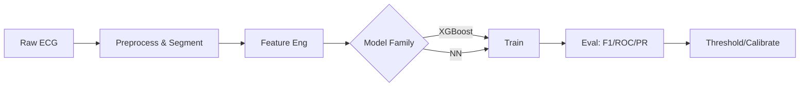
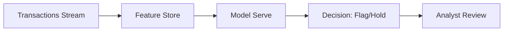
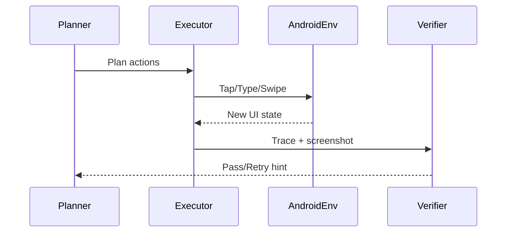

<h1 align="center">Hi, I'm Saydain 👋</h1>

<b>AI/ML Engineer</b> · M.S. Data Science @ Stevens ('25)

  
  
  
  

---

### 🚀 What I do

* Build practical **GenAI + ML systems** end‑to‑end: agentic workflows, RAG, and model serving with a focus on **latency, evals, and reliability**.
* Ship using **Pinecone, PostgreSQL, Kubernetes, FastAPI/Streamlit**, and HF/OpenAI stacks.
* Interests: **personalization**, **computer‑use agents**, **applied CV/NLP**.

> If you'd like a quick demo of any project, ping me (email badge above) — happy to share!

---

### 📈 Live dashboards & analytics

        

Tip: These are images that refresh automatically. No extra setup needed.

---

### 🏆 Featured Projects — with previews

  
  

  
  

  
  

📂 Put PNG/GIF screenshots in <code>/assets</code> with the same names to light up the gallery (or rename here).

---

### 📚 Case studies (fast reads)

<b>ECG Heartbeat Classification</b> — Arrhythmia detection with classic ML + NN

* **Problem:** Detect abnormal heartbeats from ECG segments (imbalanced classes).
* **Approach:** Feature engineering (RR intervals, morphology) → baseline models (LR, RF) → tuned XGBoost + simple NN → threshold tuning and cost‑sensitive evals.
* **Highlights:** >XX% F1 on minority class; calibration for clinical interpretability; clean EDA and error analysis.
* **Stack:** Python, scikit‑learn, XGBoost, NumPy, Pandas, Matplotlib.

<b>Credit Card Fraud Predictive System</b> — End‑to‑end imbalanced learning

* **Problem:** Real‑time fraud detection under severe class imbalance.
* **Approach:** Robust preprocessing → stratified CV → cost‑sensitive models (XGB/LightGBM) → threshold search for business cost.
* **Highlights:** Lift at top‑k, PR‑AUC gains vs baseline, clear notebook + slides.
* **Stack:** Python, scikit‑learn, XGBoost, imbalanced‑learn.

<b>Agent‑S Experiments</b> — Multi‑agent GUI automation for mobile QA

* **Problem:** Automate Android UI tasks (Wi‑Fi toggles, calendar events) with tool‑using agents.
* **Approach:** Planner → Executor → Verifier loop; structured logs; replayable tests; visual renderer.
* **Highlights:** Self‑check + recovery, modular tasks (`settings_wifi`, `calendar_create`).
* **Stack:** Python, asyncio, PIL, custom in‑memory AndroidEnv.

---

### 🧰 Tech I use

   
  
  
  
  
  
  
  
  
  
  
  
  
  
  
  
  
  
  

---

### 🧪 How I build (signals of rigor)

* **Evals-first:** simple golden sets + regression tests for RAG/agents.
* **Latency budgets:** measure p95/p99 end‑to‑end; profile token/IO hotspots.
* **Ops:** containerized services, health probes, structured logs, small PRs.

---

### 📬 Get in touch

* Email: **saydains786@gmail.com**
* LinkedIn: **https://www.linkedin.com/in/saydain-sheikh/**
* Open to: **AI/ML Engineer, Data Scientist** roles · NYC/Remote (update as needed)

---
